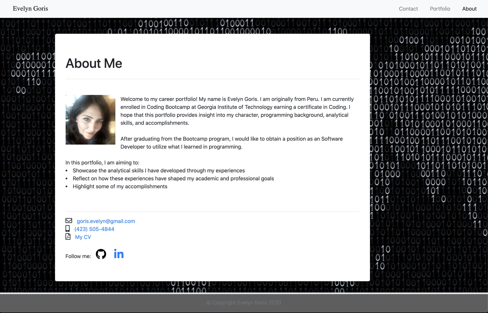

# Updated_Portfolio_EG

## Description

This **portfolio** was updated to showcase what we have learned during our 8 weeks at Georgia Tech Coding Bootcamp. 
We were asked to update our second homewor, which included an Index page, a Portfolio page, and a Contact page along with this README page.

## Preview

> "About Me" Index's Page

---

### Website

[My Portfolio](https://sirog-e.github.io/Portfolio_Evelyn_Goris/)

---

## Description

The requirements included:
* Functional, deployed application.
* GitHub repository with README describing the project.
* Navbar must be consistent on each page.
* Navbar on each page must contain links to Home/About,    
  Contact, and Portfolio pages.
* All links must work.
* Must use semantic html.
* Each page must have valid and correct HTML. (Use a validation 
  service)
* Must contain personalized information. (bio, name,  
  images, links to social media, etc.)
* Must properly utilize Bootstrap components and grid system.

## Review

When compared to the original, it looks pretty similar to the one provided. Links navigate to the locations they are supposed to. I had trouble adding the background picture. It worked from the beginning, but somehow it broke later. Same thing happened with the sticky footer. For this homework, I tried adding more comments. 

Repo links:   https://sirog-e.github.io/Updated_Portfolio_EG/
 
https://github.com/SIROG-E/Updated_Portfolio_EG